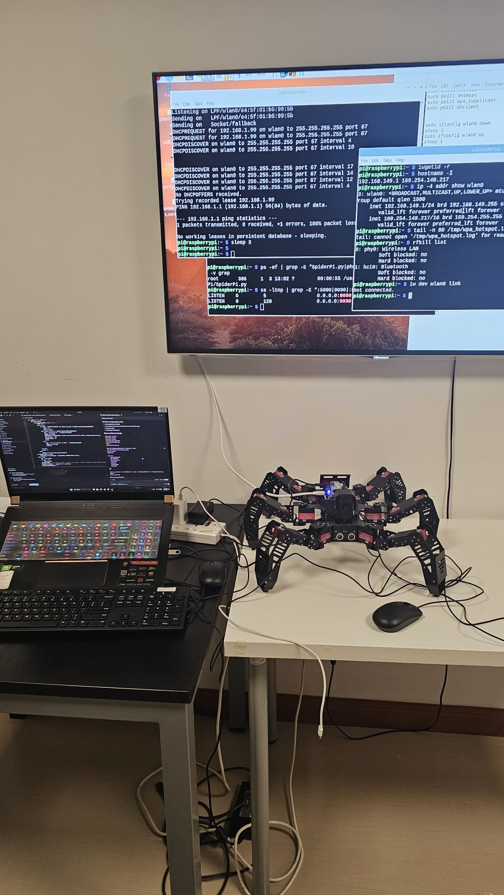

<h1 align="center">SpiderPi Edge-AI Autonomous Robotics System</h1>

  

  <b>Autonomous navigation, edge computer vision, gesture interaction, phone-based control, and IoT-style robot monitoring using a SpiderPi hexapod platform.</b>

  <a href="https://github.com/KRYPTON0078">GitHub</a> |
  <a href="https://www.linkedin.com/in/magne-dina-neves-86b164322">LinkedIn</a>

<h2>Project Overview</h2>

  This project extends the SpiderPi hexapod robot into an edge-AI autonomous robotics system.
  It integrates real-time computer vision, gesture recognition, obstacle avoidance, phone-browser control,
  voice commands, camera streaming, and mission planning.

  The project was presented at the IoT Data Hackathon 2026 in Hong Kong, where it won first place in the
  Robotics category.

<h2>Key Features</h2>

<ul>
  <li><b>Autonomous navigation:</b> forward, back, left, right, stand, stop, patrol, wave, dance, and kick actions.</li>
  <li><b>Obstacle avoidance:</b> sonar-based avoidance mode for safer movement.</li>
  <li><b>Computer vision:</b> real-time camera processing with OpenCV and SpiderPi vision modules.</li>
  <li><b>Gesture recognition:</b> CNN-based gesture model trained with TensorFlow/Keras and exported to TensorFlow Lite.</li>
  <li><b>Phone control interface:</b> mobile browser UI over the same Wi-Fi network.</li>
  <li><b>Voice command support:</b> browser-based voice input mapped to robot commands.</li>
  <li><b>AI mission commander:</b> prompt-based mission planning with optional cloud AI and local fallback.</li>
</ul>

<h2>Technical Stack</h2>

<ul>
  <li><b>Languages:</b> Python, HTML, CSS, JavaScript</li>
  <li><b>AI / ML:</b> TensorFlow, Keras, TensorFlow Lite, NumPy</li>
  <li><b>Computer Vision:</b> OpenCV, camera calibration, image preprocessing</li>
  <li><b>Robotics:</b> SpiderPi hexapod, servo action groups, sonar-based avoidance</li>
  <li><b>Networking:</b> JSON-RPC, HTTP server, MJPG camera stream</li>
</ul>

<h2>Core Components</h2>

<ul>
  <li><code>SpiderPi.py</code> - main robot runtime (camera, RPC server, MJPG stream, sonar, behavior modules).</li>
  <li><code>phone_control_server.py</code> - mobile control bridge for touch, voice, and mission planning.</li>
  <li><code>DEMO_SETUP.md</code> - setup guide for robot-side control and phone interface.</li>
  <li><code>SpiderPiGesture/</code> - gesture dataset collection, training, and TFLite export pipeline.</li>
  <li><code>web/</code> - phone browser UI assets.</li>
</ul>

<h2>Quick Start</h2>

<ol>
  <li>Start the robot core: <code>python3 SpiderPi.py</code></li>
  <li>Start the phone control server: <code>python3 phone_control_server.py</code></li>
  <li>Open <code>http://&lt;robot-ip&gt;:5000</code> on your phone browser.</li>
  <li>See <code>DEMO_SETUP.md</code> for full setup and demo flow.</li>
</ol>

<h2>Achievement</h2>

<ul>
  <li><b>First Place, Robotics Category</b> - IoT Data Hackathon 2026, Hong Kong.</li>
</ul>

<h2>Author</h2>

  <b>Magne Dina Neves</b> 
  Electrical and Computer Engineering Student, University of Macau 
  Research interests: AI security, robotics, cyber-physical systems, IoT cybersecurity, trustworthy AI

